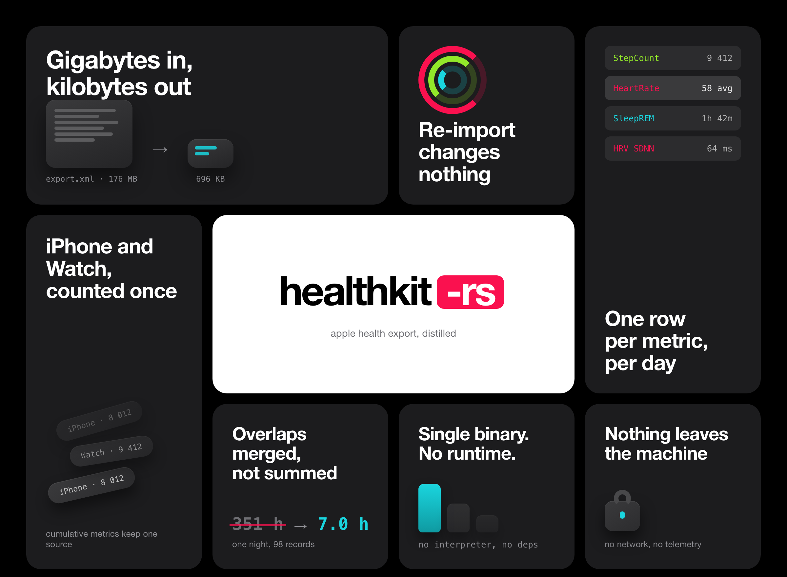

<p align="center">
  
</p>

<p align="center">
  <a href="https://github.com/itsnex1s/healthkit-rs/actions/workflows/ci.yml"></a>
  <a href="LICENSE"></a>
</p>

<h1 align="center">healthkit-rs</h1>

<p align="center">Turn an Apple Health export into a SQLite database you can actually query.</p>

---

Apple lets you export everything the Health app knows about you. What you get is
a ZIP with an XML file inside — 200–500 MB after five years with a Watch, up to
1.5 GB after ten. Every heart-rate reading in it costs about 200 bytes of markup
for a single number, and a single night of sleep can be written as 98
overlapping records.

`healthkit-rs` reads that file and writes **one row per metric per day**. A
176 MB export becomes a 696 KB database in under a second.

## Quickstart

**1. Get the export.** On the iPhone: Health → your photo, top right → *Export
All Health Data*. It takes a few minutes and produces `export.zip`. Save it to
your computer.

**2. Import it.**

```console
$ healthkit-rs export.zip health.db
reading apple_health_export/export.xml
read: 14993 records, 0 workouts, 22 summaries (1 skipped)
wrote: daily_metrics 268, sleep_stages 27, workouts_daily 0, activity_summary 22
```

**3. Ask it things.**

```console
$ sqlite3 -header -column health.db \
    "SELECT date, sum AS steps FROM daily_metrics
     WHERE metric='StepCount' ORDER BY date DESC LIMIT 5"

date        steps
----------  -------
2024-01-18  7324
2024-01-17  15343
2024-01-16  10081
2024-01-15  9818
2024-01-14  7491
```

Re-running the import is free: it is idempotent, so a fresh export just updates
the days it covers.

## Installing

```console
$ cargo install --path .
```

There is nothing else to install. The binary is self-contained — SQLite is
compiled in, and there is no interpreter or runtime to keep around.

## What you get

Four tables:

| Table | One row per | Holds |
|---|---|---|
| `daily_metrics` | day + metric | `sum`, `avg`, `min`, `max`, `samples`, `sources`, `unit` |
| `sleep_stages` | day + stage | `minutes`, `episodes` |
| `workouts_daily` | day + activity | `sessions`, `minutes`, `distance_km`, `energy_kcal` |
| `activity_summary` | day | the three rings and their goals |

Metric names are the HealthKit type without its prefix:
`HKQuantityTypeIdentifierStepCount` → `StepCount`. Sleep stages are `Core`,
`Deep`, `REM`, `Awake`, `InBed`, `Unspecified`.

All four aggregates are stored for every metric, and you pick the one that
means something. Steps want `sum`; heart rate wants `avg` and `min`:

```console
$ sqlite3 -header -column health.db \
    "SELECT date, round(avg,1) AS avg_bpm, min, max, samples
     FROM daily_metrics WHERE metric='HeartRate' ORDER BY date DESC LIMIT 4"

date        avg_bpm  min   max    samples
----------  -------  ----  -----  -------
2024-01-18  73.2     51.0  134.0  32
2024-01-17  90.6     64.0  127.0  168
2024-01-16  79.3     52.0  129.0  2640
2024-01-15  78.4     51.0  133.0  1272
```

Sleep, excluding time awake in bed:

```console
$ sqlite3 -header -column health.db \
    "SELECT date, round(sum(minutes)/60.0,1) AS hours FROM sleep_stages
     WHERE stage != 'Awake' GROUP BY date ORDER BY date DESC LIMIT 4"

date        hours
----------  -----
2024-01-18  8.7
2024-01-17  7.0
2024-01-16  7.0
2024-01-15  7.1
```

To see what your own export actually contains:

```sql
SELECT metric, count(*) AS days FROM daily_metrics GROUP BY metric ORDER BY days DESC;
```

## Rules it applies

The export is messier than it looks, so four things are decided for you. Each is
covered by a test.

**Overlapping sleep is merged, not added.** One night arrives as dozens of
overlapping records, some byte-identical. Summing their durations produced
*351 hours in a single day* on a real export. Intervals are sorted and merged
instead.

**Sleep belongs to the morning.** A night from 23:30 to 07:00 is filed under the
day you woke up.

**Repeated sources are counted once.** The iPhone and the Watch both count
steps. For cumulative metrics — steps, distance, energy, flights — the source
with the largest daily total wins; for readings like heart rate or body mass,
all sources are merged. The `sources` column tells you how many there were.
Apple's own source priority is not present in the export, so this is a
heuristic, not a reproduction of what the Health app shows.

**Units are normalised.** Miles and metres become kilometres, joules become
kilocalories. (`Cal` in HealthKit already means kilocalorie.)

## What it does not do

- **Keep raw samples.** The daily rows are the product. If you need every
  individual reading, this is the wrong tool.
- **Import routes or GPX.** Deliberately: they are the most identifying data in
  the export and the least useful for health analysis.
- **Read `export_cda.xml` or ECG data.**
- **Import categories without a number**, such as `MindfulSession`.
- **Read `WorkoutStatistics`.** Per-workout average heart rate lives there; the
  `Workout` totals are enough for daily rows.

## Speed

| Input | Records | Time | Database |
|---|---|---|---|
| Real export, 4.8 MB | 14,993 | 0.05 s | 40 KB |
| Synthetic, 176 MB | 1,000,000 | 0.81 s | 696 KB |

Parsing streams: the document is never held in memory, only the running
aggregates, bounded by `days × metrics`. A ten-year export is a bigger number in
the same shape.

## The format

Apple documents none of it, and it changes between iOS releases without notice.
What was learned while writing this — the inline DTD, the non-ISO timestamps,
the `Correlation` trap, the overlapping sleep intervals — is written up in
**[docs/format.md](docs/format.md)**.

## Development

```console
$ cargo test
$ cargo clippy --all-targets -- -D warnings
$ cargo fmt --check
```

Seven tests. Each runs the built binary against a fixture and asserts on what
reached the database, not on the behaviour of a function in isolation.

| Fixture | Covers |
|---|---|
| `legacy-export.xml` | older format, escaped `device`, third-party source, two workouts in a day, miles and metres |
| `export.zip` | finding the file inside the archive, `WorkoutRoute` with a GPX reference |
| `modern-elements.xml` | `WorkoutStatistics`, `Correlation` with a nested `Record`, `appleMoveTime`, a night crossing midnight |
| `sleep-overlap.xml` | merging overlapping sleep episodes |
| `two-sources.xml` | deduplicating iPhone against Watch |
| `basics.xml` | full inline DTD, `MetadataEntry`, idempotency |

The hero image is generated from `docs/hero.html` — open it in a browser or
re-render it with headless Chrome at `--force-device-scale-factor=2`. It uses the
iOS Health palette: black, `systemGray6`, and the activity-ring colours
`#fa114f`, `#92e82a`, `#1ad5de`.

**Dependencies:** `quick-xml`, `rusqlite` (bundled), `zip`, `clap`, `anyhow`,
`chrono`. Six, each covering something the standard library does not.

## Data in this repository

**Every fixture is synthetic.** No real measurements, no real coordinates — the
route in `export.zip` is invented. The sleep-merging bug was found on a live
export, but what was committed is a synthetic file reproducing the same shape.
The same is expected of contributions; see [CONTRIBUTING](CONTRIBUTING.md).

## License

MIT.
